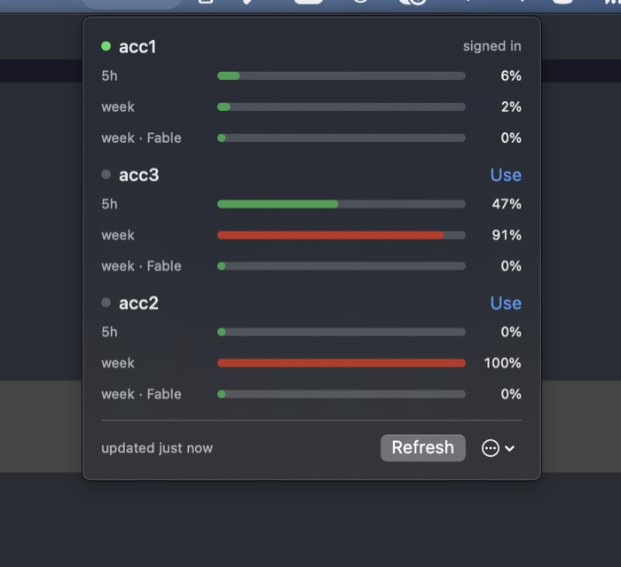

# pitboard

Switch between your own Claude Code and Codex logins, and see how much each one has left.
[usepitboard.com](https://usepitboard.com)

[](https://github.com/datlechin/pitboard/actions/workflows/ci.yml)
[](https://crates.io/crates/pitboard)
[](LICENSE)



If you have more than one Claude or ChatGPT subscription, changing accounts in Claude Code
or OpenAI's Codex CLI normally means signing out and back in through a browser. pitboard
keeps each login you are not using and puts the one you ask for where the tool reads it.
Your history, sessions, settings and projects stay where they are. Only the account
changes.

Status: pre-release. macOS is tested. On Linux it builds and the tests pass. Claude Code's
shipping build has no keyring backend outside macOS and Windows, so on Linux its login is
a plaintext file at mode 0600. Codex's default store is a file on every platform, and it is
the only Codex store pitboard supports; this was read from Codex's source and a macOS build.
pitboard's parked logins are 0600 files too. What has not happened is a run on a Linux
machine with a real signed-in Claude Code or Codex.

## Install

```sh
brew install datlechin/tap/pitboard        # the command line
brew install --cask datlechin/tap/pitboard # the menu bar app, macOS 14 or later
```

Or `cargo install pitboard`, or `cargo binstall pitboard` to fetch the built binary instead
of compiling it. On Linux, the
[latest release](https://github.com/datlechin/pitboard/releases/latest) carries static
binaries for x86_64 and aarch64; the app is a signed and notarised download there too.

Removing it: `pitboard uninstall` deletes every parked login and pitboard's own files,
leaving the account you are signed in to signed in. Then remove the binary with whatever
installed it.

## Set up

Add the account you are signed in as, then the others:

```sh
pitboard enroll personal                # the Claude Code account signed in now
pitboard enroll work --sign-in          # another Claude Code account
pitboard enroll codex/personal          # the Codex account signed in now
pitboard enroll codex/work --sign-in    # another Codex account
```

`--sign-in` runs the tool's own sign-in in a separate directory (for Codex, `codex login`
with a private `CODEX_HOME`), so the login you are using now stays put. Do not add an
account with Claude Code's `/login` or with `codex login`. Both replace the login in use,
and pitboard cannot keep a login it did not see leave. `codex login` also revokes the login
it replaces.

A label belongs to a tool: `codex/work` is a Codex account, `claude/work` a Claude Code one.
A bare name for a new account means Claude Code. In `use`, `forget` and `rename` a bare
`work` is enough while only one tool has an account called `work`; if two do, pitboard lists
both and you type the full label, such as `codex/work`. `enroll` is different: a bare name
there always means Claude Code, so a Codex account is always `codex/<label>` when you enrol
it or sign in to it again.

## Daily use

```sh
pitboard                  # who is signed in to each tool, and what each account has left
pitboard use claude/work  # switch Claude Code
pitboard use codex/work   # switch Codex
pitboard status --offline # the last numbers measured, without asking anyone
```

```text
● personal  me@example.com  signed in
    5h    ██████░░░░   59%  resets in 1h 10m
    week  ███████░░░   73%  resets in 5d 18h
          about 48m left at this rate

○ work      me@company.com  ready · good for 26d 4h
    5h    █░░░░░░░░░   12%  resets in 3h 02m
    week  ████░░░░░░   40%  resets in 2d 4h
          resets in 3h 02m
```

The last line of each account is the one that answers the question. 73% of a weekly limit
means nothing without knowing whether it was 40% this morning, so pitboard keeps what each
limit has been doing and works out how long the account lasts: until its tightest limit
fills at the rate it has been filling, or until that limit resets, whichever comes first.
It says nothing at all until there is enough to go on, because a wrong answer here tells
you to switch when you need not.

Usage comes from Anthropic for Claude Code accounts and from OpenAI for Codex accounts, for
all accounts at once. A number is asked for again once the tightest limit it describes could
have moved by a percentage point, which for a five-hour window is three minutes, so running
`pitboard` twice in a row costs one set of requests and the app and the command line share
one between them. `pitboard status --fresh` asks anyway. If a parked
login has expired, pitboard renews it first. If the service cannot be reached, or asks for
less traffic, you get the last numbers pitboard saw, and when it saw them.

A Claude Code session that is already open picks up the switch within about 33 seconds. You
do not have to restart it. A running `codex` does not pick it up at all: restart it (see
[Codex](#codex)).

Each account holds one parked login. Switching to an account uses that login up, and
switching away parks a fresh one. A parked login is renewed whenever you run `pitboard`,
and otherwise not, so one you leave alone for weeks expires and needs a browser sign-in.
`pitboard schedule install` hands that to your computer's own scheduler instead. If one
expires or goes missing, sign in to that account again. The rest of what pitboard knows about it stays:

```sh
pitboard enroll work --sign-in
```

For a Codex account, name the tool: `pitboard enroll codex/work --sign-in`.

Signing in again to the account you are using puts the new login in use in place of the old
one, the way the tool's own sign-in would, and parks nothing. A running `codex` keeps the old
login until you restart it.

Other commands:

- `pitboard rename wrong right` fixes a label without signing in again. A rename stays
  inside its tool: `pitboard rename codex/work job` gives you `codex/job`.
- `pitboard forget <label>` drops an account, as in `pitboard forget codex/old`.
- `pitboard doctor` checks what pitboard depends on in Claude Code, and every parked login
  of both tools.
- `pitboard log` shows what pitboard has changed, and when.
- `pitboard abandon` gives up on an interrupted switch that cannot be finished, keeping
  every login. Only needed when recovery cannot reach Anthropic.
- `pitboard repair` asks the keychain what parked logins are on this machine and accounts
  for every one: given back to the account it belongs to, or reported and left alone.
  Only needed if pitboard's own files were lost or restored from a backup. A login it gives
  back that this pitboard did not write may be another pitboard's, so `forget` and
  `uninstall` leave it where it is.
- `pitboard adopt` takes over a `~/.pitboard` that came from another computer, keeping the
  accounts and dropping the logins they came with. Each then needs one
  `pitboard enroll <label> --sign-in`.
- `pitboard renew` renews every parked login that is due, and nothing else.
- `pitboard schedule install` asks this computer's own scheduler to run that daily, so
  parked logins stay alive while you are away. Opt-in; `pitboard schedule status` says
  whether it is on and `pitboard schedule uninstall` takes it away.
- `pitboard uninstall` deletes every parked login and pitboard's own files.

## Codex

pitboard leaves Codex alone until you enrol a Codex account. Before that, `pitboard` shows
no Codex row, reads nothing of Codex's and asks OpenAI nothing.

Codex works like Claude Code in pitboard, except for these:

- A running `codex` never notices a switch. Restart it. After a switch, on the command line
  or in the menu bar app, pitboard counts the `codex` processes running and tells you to
  quit them.
- Quit those sessions; do not type `/logout` in one. Signing out there revokes the old
  account's login at OpenAI, and that is the login pitboard has just parked. The account
  would then need a browser sign-in.
- pitboard works with Codex's default store, the file `~/.codex/auth.json` (or
  `$CODEX_HOME/auth.json`). If `config.toml` sets `cli_auth_credentials_store` to `keyring`
  or `auto`, pitboard refuses and says why: those keychain items belong to Codex, and every
  read by another program would ask you for permission. It also refuses `ephemeral`, which
  keeps the login in memory only, so there is nothing to park.
- Only a ChatGPT sign-in can be switched. A Codex signed in with an API key has no account
  login to park.
- The account is read from the login's own ID token, with no request. Two people in one
  ChatGPT Team or Business workspace are two accounts.
- On macOS a Codex park is the whole `auth.json`, which is too big for `security`'s standard
  input, so it goes on the argument line. pitboard says so after a switch or a `--sign-in`
  enrolment, but not when it renews a parked login. See the question about the keychain
  below.

## Status line

`pitboard statusline` prints one line with the account in use and what every account has
left:

```text
personal 59%·73%  work 12%·40%
```

It reads what Claude Code passes on stdin plus pitboard's own files, and lists Claude Code
accounts only, since Claude Code is what runs it. It does not use the network and does not
touch a login. Add it to `~/.claude/settings.json`:

```json
{ "statusLine": { "type": "command", "command": "pitboard statusline" } }
```

To combine it with a status line of your own, pipe the same input to it:
`echo "$input" | pitboard statusline`.

## Menu bar app

The menu bar shows the account in use and its tightest limit. Open the panel to see every
account's limits and switch with one click. When an account runs out, the app says so once
and offers the account with the most left.

With accounts of both tools, the panel lists them under a heading per tool, and the menu
bar follows the signed-in account closest to running out, whichever tool it is for. When
an account runs out, only another account of the same tool is offered. A Codex switch has
no countdown: the panel says that running `codex` sessions keep the old account until you
quit them and start them again, and how many pitboard found running, if any. "Add another
account" asks which tool the account is for when both are installed.

It calls the same core as the command line rather than running `pitboard` for each answer.
The panel adds and drops accounts itself. The cask installs the command line too, for
renaming, `pitboard repair`, scripts and the status line. Usage is read when you open the panel and every few minutes while the
app runs. "Open at login" is in the menu at the bottom right. A copy from a release keeps
itself up to date. One you build yourself does not, because it carries no update key:

```sh
./apple/scripts/build-app.sh
cp -R apple/build/Pitboard.app /Applications/
```

## Scripting

Every command that reports a result takes `--json` and prints the same envelope, including
on failure and for a mistyped command line: `{v, command, ok, data, warnings, error}`.
Error codes are stable. When a failure came from asking Anthropic or OpenAI, `error.cause`
says what went wrong underneath and whether asking again is worth anything:
`{"code": "rate_limited", "worth_retrying": true}`. `completions` and `manpage` write a generated file to stdout, so
they have no JSON form and refuse the flag rather than ignore it.
Exit codes: 0 done, 1 not done, 2 command line wrong, 3 a login or a tool's files are in a
state pitboard will not act on.

`use` names the tool in `provider`. `adoption` says whether sessions already running follow
on their own (`{"follows": "polling", "within_seconds": 33}`) or need a restart
(`{"follows": "restart", "program": "codex"}`); in the second case
`adoption_ceiling_seconds` is null.

Shell completions: `pitboard completions zsh` (or `bash`, `fish`, `elvish`, `powershell`).

The same ground, on one page: [usepitboard.com/guide](https://usepitboard.com/guide/).

## What it will not do

These are rules, not gaps:

- No switching by itself on any server signal.
- No pooling or proxying of requests, and no `ANTHROPIC_BASE_URL` interception.
- No failover when an account is on hold.
- No renewing of the login you are signed in as. That is the tool's own job. pitboard
  renews only a login it parked itself.
- No export, import or sync of parked logins between machines.

The last one is a safety rule, not a missing feature. Each machine has to sign in to each
account itself. If a machine presents a refresh token another machine has already rotated,
Claude Code drops the login on both. If a `~/.pitboard` does arrive from another computer,
for instance through Migration Assistant, `pitboard adopt` keeps the accounts and drops the
logins rather than leaving you with a tool that refuses to do anything.

## What a switch costs you

None of these are pitboard's to fix, so they are listed plainly:

- Remote Control turns off for a conversation that was started under a different account.
  Claude Code does that when it sees the owner change.
- The prompt cache belongs to one account, so the first message after a switch rebuilds it.
  Measured on this project, that costs about the same as leaving a session idle for an
  hour, which a five-hour limit usually means has happened anyway.
- Usage for a parked account is read with its parked login, so work done on other machines
  counts too.
- A running `codex` keeps using the account it started with until you restart it.

## What it talks to

For Claude Code accounts, Anthropic:

- `api.anthropic.com/api/oauth/profile`: which account a login belongs to.
- `api.anthropic.com/api/oauth/usage`: what an account has left.
- `platform.claude.com/v1/oauth/token`: renewing a login pitboard parked, with Claude Code's
  own client id.

For Codex accounts, OpenAI:

- `chatgpt.com/backend-api/wham/usage`: what an account has left, and before a switch,
  whether OpenAI still accepts the incoming login. Codex makes the same read, and it spends
  no quota.
- `auth.openai.com/oauth/token`: renewing a login pitboard parked, with Codex's own public
  client id.

Which account a Codex login belongs to is read from the login itself, with no request.
pitboard has no telemetry and no server of its own. A copy of the app from a release also
checks `github.com/datlechin/pitboard` for updates.

## Questions people ask first

**Where do my tokens go?** Only to the service that issued them: Anthropic for Claude Code,
OpenAI for Codex, at the addresses listed above. Parked logins stay on the machine that made
them, in the keychain on macOS.

**Is this allowed?** pitboard only moves logins you already hold, between its own store and
the place each tool reads. It does not share an account between people, pool requests, or
touch an account you do not own. Whether several subscriptions suit what you are doing is
between you and Anthropic's or OpenAI's terms.

**What if it dies halfway through a switch?** It writes down what it is about to do before
it does it, including a fingerprint of the login on each side. The next command reads which
one is in place and finishes or undoes the switch from that, with no network needed. Only
when the login in place is neither, which is what the tool refreshing a token in those few
seconds looks like, does it need to work out whose login it is. A Codex login names its own
account, so that needs no network. A Claude Code login needs Anthropic to say, and when
pitboard cannot ask, it changes nothing and keeps the record for a later run. `pitboard
doctor` reports the state, and `pitboard log` is the record of every change it has made.

**My login is too big for the keychain, what now?** On macOS, `security` reads only about
two kilobytes of a command from standard input. A Claude Code login goes over that when it
holds MCP server tokens, and a Codex park always does, since it is the whole `auth.json`.
Past that there is one route left, passing it as an argument, where another process running
as you could read it while the call lasts. Claude Code does the same for its own login on
every token refresh. pitboard does it too, and says so after a switch or a `--sign-in`
enrolment that does it. It does not say so when it renews a parked login, and on macOS
every Codex park renewal goes that way. `PITBOARD_NO_ARGV=1` refuses instead, which on
macOS means no Codex account can be parked. Set it before parking any Codex account: with a
Codex park already in the keychain, the next renewal exchanges the refresh token and then
cannot store the result, and that account's parked login is lost. `pitboard doctor` shows
the size of the Claude Code login.

**What about Gemini CLI?** Not supported. Since 18 June 2026 Google no longer offers Gemini
CLI's "Login with Google" to individual, Google AI Pro and Google AI Ultra accounts
([notice](https://developers.google.com/gemini-code-assist/docs/deprecations/code-assist-individuals)).

**Why trust the download?** The macOS app is signed with a Developer ID and notarised by
Apple, and its update feed is signed too. Every release attests what it published: each
archive, the source tarball Homebrew builds from, `SHA256SUMS`, a bill of materials beside
each artefact, and `appcast.xml`, which is the file that decides what an installed copy
runs next. The attestation names the workflow and the commit that produced the file:

```sh
gh attestation verify Pitboard-v0.1.5-macos.zip --repo datlechin/pitboard
gh attestation verify SHA256SUMS --repo datlechin/pitboard
gh attestation verify appcast.xml --repo datlechin/pitboard
```

`SHA256SUMS` is worth attesting rather than only reading: on its own it is evidence against
a download that went wrong, not against anyone who could change the release.

Or build it yourself: `cargo install pitboard`.

## How it works

Parked logins live in the keychain on macOS and in files under `~/.pitboard/vault/` on
Linux. pitboard will not move a login it cannot identify.

For Claude Code, pitboard asks Anthropic which account a login belongs to instead of
trusting Claude Code's config file, which can be a day behind the login it describes. On
macOS, Claude Code keeps its login in a keychain item that only `/usr/bin/security` is
trusted to read. pitboard reads and writes it with the same tool. Calling the Security
framework from another process changes that item's access list for good, and after that
every read Claude Code makes takes one to three seconds instead of a few milliseconds.
pitboard takes the same lock Claude Code takes around credential writes, and never writes
Claude Code's plaintext fallback file for you.

For Codex, the login is the file `~/.codex/auth.json`. Its ID token names the account, so
identifying it needs no request. `codex login` and `codex logout` revoke the stored refresh
token at OpenAI, so a Codex login is moved, never copied: the outgoing one goes into
pitboard's store and is read back before the incoming one is written. Codex takes no lock on
that file, so pitboard reads it back after a switch rather than trusting its own write.

See [SECURITY.md](SECURITY.md) for where your credentials live and what pitboard protects
against.

## Licence

Apache-2.0. Not affiliated with Anthropic or OpenAI. See [NOTICE](NOTICE).
